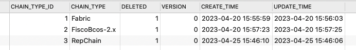
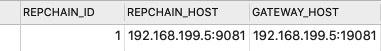

### 存储模块[Storage](https://gitee.com/BTAJL/repchain-cross-storage)

将原链和目标链的区块交易等数据同步到数据库中，同时解析RepChain跨链管理合约的state数据，自动提交代理跨链交易、监测目标链区块并提交出块回执到RepChain上

#### 构建需要准备的环境及工具

##### 1. Java 1.8 (**必须**)

> 建议使用`zulu-jdk`（oracle-jdk也可），从[官网](https://www.azul.com/downloads/?version=java-8-lts&package=jdk)直接下载，也可使用**IDEA**下载(File->Project Structure->SDKS，然后选择"+"，选择Download JDK)，选择Azul-zulu-community，jdk-8。
>
> 1. 如果是直接下载，需要配置环境变量
>
> 2. 如果是在ide中，下载后，指定相应版本jdk即可

##### 2. [**Maven**](http://maven.apache.org/index.html)项目构建管理工具 (**必须**)

> Maven 是一个项目管理工具，可以对 Java 项目进行构建、依赖管理，是一个自动化构建工具。
>
> 自动化构建工具：将原材料（java、js、css、html....）->产品（可发布项目）
>
> 编译-打包-部署-测试  ->  自动构建可从[官网](http://maven.apache.org/index.html)下载并配置相关信息。

!!! warning "注意"

    * 需要将Maven的配置到系统的环境变量中，以方便在终端中使用maven命令。
    * 需要将同一个Maven地址配置到使用的编译器中，防止项目构建时出现其他问题。

在环境工具准备完成之后，在项目根目录下，打开终端，执行如下命令（或者是用IDEA中对应的maven插件执行相应命令），将模块打包为jar包并安装到本地maven仓库，之后别的依赖DataType的跨链模块就可以引用该jar包了。

```
mvn clear
mvn compile
mvn install
```

构建完成并安装到本地库后，**其他跨链模块**即可通过如下方式引用：

```xml
// maven
<dependency>
    <groupId>net.repchain</groupId>
    <artifactId>repchain-cross-storage</artifactId>
    <version>1.0-SNAPSHOT</version>
</dependency>
```

```xml
// gradle
implementation 'net.repchain:repchain-cross-storage:1.0-SNAPSHOT'
```

```xml
// sbt
libraryDependencies += "net.repchain" % "repchain-cross-storage" % "1.0-SNAPSHOT"
```


| 数据库表              | 简要说明                                                     |
| --------------------- | ------------------------------------------------------------ |
| chain_type_base       | 链类型基表                                                   |
| cross_account_info    | RepChain上的账户证书表                                       |
| cross_block           | 原链RepChain以及目标链FiscoBcos-2.x等链的区块数据            |
| cross_chain_info      | RepChain和FiscoBcos-2.x的链信息，其中chain_hash对应适配器id，config_path对应配置文件地址，该配置文件会上传到网关那边 |
| cross_contract_info   | 主要注册所涉及到的合约信息                                   |
| cross_repchain_config | 提交回执时候需要其中的repchain_host                          |
| cross_route_info      | 从哪个合约跨到哪个合约                                       |
| cross_transaction     | 原链RepChain以及目标链FiscoBcos-2.x等链的交易数据            |

Chain_type_base:



Cross_repchain_config:




#### 使用方式

主要两行如下：

```java
// 构造存储对象
BlockStorageStub blockStorageStub = new BlockStorageStub(dataSource);
// 存储解析
blockStorageStub.saveBlock(info, block, gateWayHost);
```

或

```java
RepBlockStorage repBlockStorage = new RepBlockStorage(dataSource);
repBlockStorage.saveBlock(info, block, gateWayHost);
```

将同步模块与存储模块结合使用的示例如下：

```java
package rep.cross.storage;

import com.rcjava.protos.Peer;
import lombok.SneakyThrows;
import org.junit.jupiter.api.*;
import rep.cross.adapter.model.AdapterInfo;
import rep.cross.adapter.model.AdapterType;
import rep.cross.adapter.model.Block;
import rep.cross.storage.impl.BlockStorageStub;
import rep.cross.storage.impl.fabric2.Fabric2BlockStorage;
import rep.cross.storage.impl.fisco.FiscoBlockStorage;
import rep.cross.storage.impl.rep.RepBlockStorage;
import rep.cross.sync.SyncChainService;
import rep.cross.sync.exception.SyncBlockException;
import rep.cross.sync.model.SyncInfo;

import java.lang.reflect.Constructor;
import java.util.HashMap;

/**
 * @author zyf
 */
@TestMethodOrder(MethodOrderer.OrderAnnotation.class)
@TestInstance(TestInstance.Lifecycle.PER_CLASS)
public class SyncServiceTest extends BaseTest {

    // repchain
    SyncInfo repSyncInfo = SyncInfo.builder().setLocalHeight(0).setLocBlkHash("").build();
    AdapterInfo repAdapterInfo = AdapterInfo.builder().setId("79e5d00cc30f40d3a857ec4511c4fa4e").setType(AdapterType.REPCHAIN).build();
		
  	// 构造存储对象
    BlockStorageStub blockStorageStub = new BlockStorageStub(dataSource);
    RepBlockStorage repBlockStorage = new RepBlockStorage(dataSource);

    @Test
    @DisplayName("测试repchain同步")
    void testRepSyncService() throws InterruptedException {
        // 初始化同步程序
        SyncChainService repSyncChainService = new SyncChainService(repAdapterInfo, repSyncInfo, gateWayHost);
        RepBlockStorage repBlockStorage = new RepBlockStorage(dataSource);
        logger.info("准备同步...");
        repSyncChainService.start(new SyncChainService.CallBack() {
            @Override
            public void onSuccess(AdapterInfo info, Block block) throws SyncBlockException {
                // repchain
                Peer.Block repBlock = objectMapper.convertValue(block.getRawBlock(), Peer.Block.class);
                try {
                    // repchain
                 	System.out.println(objectMapper.writerWithDefaultPrettyPrinter().writeValueAsString(repBlock));
                    // 存储解析
                    blockStorageStub.saveBlock(info, block, gateWayHost);
                  	// 存储解析
                    // repBlockStorage.saveBlock(info, block, gateWayHost);
                } catch (Exception e) {
                    throw new SyncBlockException(e.getMessage());
                }
                System.out.println(block.getHash());
            }

            @Override
            public void onError(SyncBlockException syncBlockException) {

            }
        });
        Thread.currentThread().join();
    }

}

```

