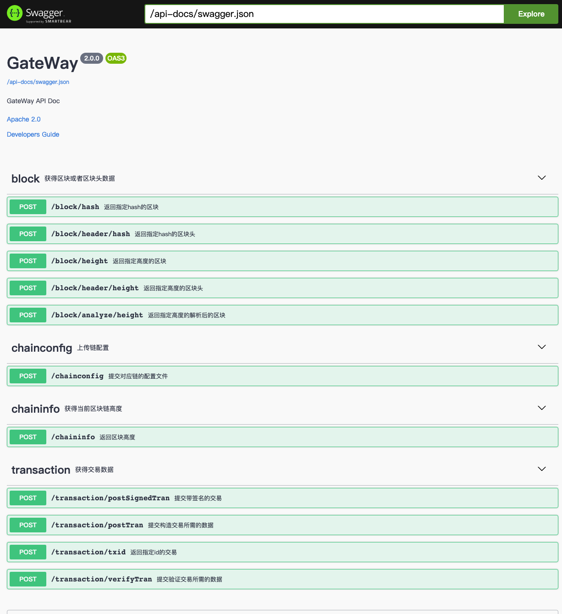

### 跨链[网关](https://gitee.com/BTAJL/repchain-cross-gateway)

#### 构建需要准备的环境及工具

##### 1. Java 11(**必须**)

> 建议使用`zulu-jdk`（oracle-jdk也可），从[官网](https://www.azul.com/downloads/?version=java-11-lts&package=jdk#zulu)直接下载，也可使用**IDEA**下载(File->Project Structure->SDKS，然后选择"+"，选择Download JDK)，选择Azul-zulu-community，jdk-11。
>
> 1. 如果是直接官网下载，需要配置环境变量
>
> 2. 如果是在IDEA中下载，下载后，在IDE中指定相应版本jdk即可

##### 2. [**Sbt**](https://www.scala-sbt.org/)项目构建管理工具 (**必须**)

> Sbt是一个项目管理工具，可以对 Scala项目进行构建、依赖管理，是一个自动化构建工具。

!!! warning "注意"
	* 需要将Sbt配置到系统的环境变量中，以方便在终端中使用sbt命令
    * 推荐使用1.4.x的版本，不要使用1.3.x和1.5.x

在环境工具准备完成之后，在项目根目录下，打开终端，执行如下命令（或者是在IDEA中先安装**scala插件**，然后用[IDEA](https://www.jetbrains.com/help/idea/sbt-support.html#manage_sbt_projects)中的[sbt-shell](https://www.jetbrains.com/help/idea/sbt-support.html#sbt_shell)执行相应命令），将模块打包为可执行jar包，打包好的jar包在`target/scala-2.12/repchain-cross-gateway-assembly-0.1.jar`，之后即可在有java11的环境下部署使用。

```
sbt
> clean
> compile
> assembly
```

#### 使用方式

##### 启动方式

> 这里指的是启动网关管理服务

1.终端下启动：

jar包部署目录如下：

    ```
    ├── conf
    │   ├── 121000005l35120456.node1             预置网关实例1的配置文件
    │   ├── 12110107bi45jh675g.node2		     预置网关实例2的配置文件
    │   ├── logback.xml							 日志的配置文件
    │   └── management							 网关实例管理服务的配置文件
    ├── jks
    │   ├── credence-net
    │   ├── identity-net						 ssl时需要
    │   └── management							 ssl时需要
    └── repchain-cross-gateway-assembly-0.1.jar	 可执行jar包
    ```

   可直接将jar包放在项目根目录下使用如下命令来启动，启动命令如下：

   ```shell
   java -Dlogback.configurationFile=conf/logback.xml -jar repchain-cross-gateway-assembly-0.1.jar
   ```

2.IDEA启动：

   直接如下图配置即可

   > !!! warning "注意" 
   >     其中vm参数可以参考如下：
   >     ```
   >     --add-exports java.base/jdk.internal.misc=ALL-UNNAMED
   >     --add-opens java.base/jdk.internal.misc=ALL-UNNAMED
   >     -Dio.netty.tryReflectionSetAccessible=true
   >     --illegal-access=warn
   >     ```

   

##### 网关管理服务

GateWayManagement类似于RepChainManagement，启动网关管理服务（即运行上一小节提到的启动命令）后，接着启动一个GateWay实例（类似于RepChain节点），即启动一个跨链网关实例，如启动***.node1，相当于起了一个跨链网关实例

* GateWayManagement
  > 跨链网关实例管理服务
  
* GateWayManagement的配置文件：
  > conf/management/system.conf
  >
  > 其中常用的配置项为：http_service_port = 7081 #http服务的端口号，默认为7081

* 启动GateWay--1（可以从swagger-ui上启动）
  > curl -X GET "http://localhost:7081/management/system/SystemStartup/121000005l35120456.node1" -H  "accept: text/plain"

* GateWayManagement的swagger-ui如下：
  > http://localhost:7081/swagger/index.html
    

* 停止GateWay--1（可以从swagger-ui上停止）
  > curl -X GET "http://localhost:7081/management/system/SystemStop/121000005l35120456.node1" -H  "accept: text/plain"

##### 网关服务

跨链网关目前实现了3种类型区块链（RepChain、Fabric-2.x、FiscoBcos-2.x）的适配器，用来对接对应的目标链

> 1. 可查询repchain、fisco-bcos2.x、fabric-2.x：查询区块、区块头、交易、chainInfo
>
> 2. 代理向repchain、fisco-bcos2.x、fabric-2.x：提交交易

* GateWay
  > 跨链网关实例，通过网关管理服务启动一个网关实例GateWay--1

* GateWay-1的配置文件：
  > conf/121000005l35120456.node1/system.conf
  >
  > 常用的配置项：http_service_port = 19081 #http服务的端口号

* GateWay--1的swagger-ui如下：
  > http://localhost:19081/swagger/index.html
  

##### 适配器的配置文件

* conf/74e8089786e54f859112d20666719ac6（fisco-bcos配置文件）

  > accounts：存放的代理提交交易的密钥对
  >
  > nodes：区块链节点的证书
  >
  > sdk：连接区块链节点要用的一些密钥对和证书
  >
  > applicationContext.xml：连接节点用的配置文件

* conf/74e8089786e54f859112d20666719ac7（fabric配置文件）

  > > wallet：存放的代理提交交易的密钥对
  > >
  > > ca.org1.example.com-cert.pem：ca证书
  > >
  > > connection-org1.yaml：连接区块链网路要用的配置文件
  > >
  > > **fabric.conf**
  > >
  > > ```yaml
  > > fabric {
  > >   proxyUserId = "appUser"  # 用户id
  > >   channelName = "mychannel"  # 通道id
  > >   netWorkConfName = "connection-org1.yaml"  # 链接网络的配置文件名
  > > }
  > > ```

* conf/79e5d00cc30f40d3a857ec4511c4fa4e（repchain配置文件）

  > >jks：暂时没用
  > >
  > >pem： 代理提交交易的密钥对
  > >
  > >**repchain.conf**
  > >
  > >```yaml
  > >rep {
  > >  host = "127.0.0.1:9081"  # repchain地址
  > >  ssl = false
  > >}
  > >```

##### 网关接口

目前实现的网关接口如下，其他接口为预留，暂未实现

| 接口路径              | 接口说明                                                   | 请求方式 |
| --------------------- | ---------------------------------------------------------- | -------- |
| /block/hash           | 根据区块hash查询区块Json                                   | POST     |
| /block/header/hash    | 根据区块hash查询区块头Json                                 | POST     |
| /block/height         | 根据区块高度查询区块Json                                   | POST     |
| /block/header/height  | 根据区块高度查询区块Json                                   | POST     |
| /block/analyze/height | 根据区块高度查询区块（抽象出来的Block数据结构）            | POST     |
| /chaininfo            | 查询对应链的当前链高度和对应的区块hash                     | POST     |
| /transaction/txid     | 根据交易ID查询交易                                         | POST     |
| /transaction/postTran | 提交构造交易所需的参数，交给网关来代理构造并提交交易到链上 | POST     |
| /chainconfig          | 提交链配置（适配器配置）                                   | POST     |

示例：

> 返回成功code为0，失败code为1

1.`/block/hash`
   ```json
   请求：
   {
     "hash": "0xe2bf503cfcb9ba5a9c06f4937a1be64499c670f0f149f2a86a2c686df898cf9b",
     "adapterInfo": {
       "id": "74e8089786e54f859112d20666719ac6",
       "type": "FiscoBcos-2.x"
     }
   }
   响应：
   {
     "code": 0,
     "msg": "success",
     "data": {
       "number": 7,
       "hash": "0xe2bf503cfcb9ba5a9c06f4937a1be64499c670f0f149f2a86a2c686df898cf9b",
       "parentHash": "0xb7a203f59fc0fa9e9c8f582cc8ec8120eab8f534c2edfd76263a845f9b6211eb",
       "nonce": 0,
       "sha3Uncles": null,
       "logsBloom": "0x00000000000000000000000000000000000000000000000000000000000000000000000000000000000000000000000000000000000000000000000000000000000000000000000000000000000000000000000000000000000000000000000000000000000000000000000000000000000000000000000000000000000000000000000000000000000000000000000000000000000000000000000000000000000000000000000000000000000000000000000000000000000000000000000000000000000000000000000000000000000000000000000000000000000000000000000000000000000000000000000000000000000000000000000000000000",
       "transactionsRoot": "0xc2df033db34f57cdabbd83ac15cd02a5ebba2f50d7e7c76a0827aff406752707",
       "stateRoot": "0xab710c2d29b0dc7a578697e2ee376a610e604b910c462b4b2e4dca6f322d06d7",
       "receiptsRoot": "0x15edbbf89498b882d934e58b7e947790a1a6525d152ccfdef2d075082f50b7e5",
       "author": null,
       "sealer": "0x1",
       "mixHash": null,
       "extraData": [],
       "gasLimit": 0,
       "gasUsed": 0,
       "timestamp": 1675138168205,
       "transactions": [
         {
           "hash": "0x4ae16a0543115815d1d6414babd86eec5238f8311adfd3b3f102f6ba68f1b610",
           "nonce": 7.335514695094679e+74,
           "blockHash": "0xe2bf503cfcb9ba5a9c06f4937a1be64499c670f0f149f2a86a2c686df898cf9b",
           "blockNumber": 7,
           "transactionIndex": 0,
           "from": "0x71440f40691d8b2e2c6e1cce7685f7e4000cfcd1",
           "to": "0x1c5272691b76d6d52afa4276ab083e97bb031f44",
           "value": 0,
           "gasPrice": 300000000,
           "gas": 300000000,
           "input": "0x4ed3885e0000000000000000000000000000000000000000000000000000000000000020000000000000000000000000000000000000000000000000000000000000003348656c6c6f2c20464953434f2042434f532c20303265393734316436383665346239626164346434613965396164396361303500000000000000000000000000",
           "creates": null,
           "publicKey": null,
           "raw": null,
           "r": null,
           "s": null,
           "v": 0,
           "valueRaw": "0x0",
           "gasPriceRaw": "0x11e1a300",
           "gasRaw": "0x11e1a300",
           "nonceRaw": "0x19f2ce839ba92fd87f10bf8b58870abca69aa4891a591e0285bdc0608156f02",
           "transactionIndexRaw": "0x0",
           "blockNumberRaw": "0x7"
         }
       ],
       "uncles": null,
       "sealerList": [
         "3f0bd8b2473afe620b5acdf3c9f2386a6fd0a842c9ec7178fe2afd0509e5033dce4feff07c55491bdec26e439147c88e1d235a8a60f223c1d0bced74ee8e627d",
         "4af881f42741082500bd8c3e6c7d0c3c6074c8d7bbd333cb2bb346f7ab8c9c99401276088ab7a80a588298ca8c8c18d95e342181f7d650b6890a9eec4ef789d3",
         "7bf4a65cec1e16a4044fafb4c2620ac281316deb17f5b863d98de5d117c9e1907f69e7bf0a4dbef3c78635aefefcf3195d47e18f267528bcd6b48c7dfcd82332",
         "b28de33b2b20421f9ca2658e36826bd1717666e7daa6fe05ae54754bdbcfc789d3d94143696a387aa9099cf6176b1014b8e06d110de4c6a5dca8a2a9d367f49a"
       ],
       "numberRaw": "0x7",
       "nonceRaw": null,
       "gasLimitRaw": "0x0",
       "timestampRaw": "0x1860603f58d",
       "gasUsedRaw": "0x0"
     }
   }
   ```

2.`/block/header/hash`

   ```json
   请求：
   {
     "hash": "0xe2bf503cfcb9ba5a9c06f4937a1be64499c670f0f149f2a86a2c686df898cf9b",
     "adapterInfo": {
       "id": "74e8089786e54f859112d20666719ac6",
       "type": "FiscoBcos-2.x"
     }
   }
   响应：
   {
     "code": 0,
     "msg": "success",
     "data": {
       "dbHash": "0xab710c2d29b0dc7a578697e2ee376a610e604b910c462b4b2e4dca6f322d06d7",
       "extraData": [],
       "gasLimit": "0x0",
       "gasUsed": "0x0",
       "hash": "0xe2bf503cfcb9ba5a9c06f4937a1be64499c670f0f149f2a86a2c686df898cf9b",
       "logsBloom": "0x00000000000000000000000000000000000000000000000000000000000000000000000000000000000000000000000000000000000000000000000000000000000000000000000000000000000000000000000000000000000000000000000000000000000000000000000000000000000000000000000000000000000000000000000000000000000000000000000000000000000000000000000000000000000000000000000000000000000000000000000000000000000000000000000000000000000000000000000000000000000000000000000000000000000000000000000000000000000000000000000000000000000000000000000000000000",
       "number": 7,
       "parentHash": "0xb7a203f59fc0fa9e9c8f582cc8ec8120eab8f534c2edfd76263a845f9b6211eb",
       "transactionsRoot": "0xc2df033db34f57cdabbd83ac15cd02a5ebba2f50d7e7c76a0827aff406752707",
       "sealer": "0x1",
       "sealerList": [
         "3f0bd8b2473afe620b5acdf3c9f2386a6fd0a842c9ec7178fe2afd0509e5033dce4feff07c55491bdec26e439147c88e1d235a8a60f223c1d0bced74ee8e627d",
         "4af881f42741082500bd8c3e6c7d0c3c6074c8d7bbd333cb2bb346f7ab8c9c99401276088ab7a80a588298ca8c8c18d95e342181f7d650b6890a9eec4ef789d3",
         "7bf4a65cec1e16a4044fafb4c2620ac281316deb17f5b863d98de5d117c9e1907f69e7bf0a4dbef3c78635aefefcf3195d47e18f267528bcd6b48c7dfcd82332",
         "b28de33b2b20421f9ca2658e36826bd1717666e7daa6fe05ae54754bdbcfc789d3d94143696a387aa9099cf6176b1014b8e06d110de4c6a5dca8a2a9d367f49a"
       ],
       "signatureList": [
         {
           "index": "0x3",
           "signature": "0x018c6cd0a281faf42a6bf16f4620f16891015092636bc9ab1b033b9e32bdfb7d52ee532a8949108fc09516f49d20e0f5bee2e7260f8771be05e14a59978b770000"
         },
         {
           "index": "0x2",
           "signature": "0xf01fc506aba99ccdf7dc1539cd05aee44588ea583db685a2a09f2b74a78ada0a64a33bdddc49c35a1e881ebd2bd7f580f556dfbf7d3ddcfa4c8ad783dd9451d001"
         },
         {
           "index": "0x0",
           "signature": "0xb88b6d30b4d2e68f71d1c6e40d108632bbea791bb6589aa5ba5f13d5df241341033dc9efd509612769957440a419701f413fe88dcd71c318b05e145eebbfb10300"
         }
       ],
       "stateRoot": "0xab710c2d29b0dc7a578697e2ee376a610e604b910c462b4b2e4dca6f322d06d7",
       "receiptsRoot": "0x15edbbf89498b882d934e58b7e947790a1a6525d152ccfdef2d075082f50b7e5",
       "timestamp": "0x1860603f58d",
       "numberRaw": "7"
     }
   }
   ```

3.`/block/height`

   ```json
   请求：
   {
     "height": 7,
     "adapterInfo": {
       "id": "74e8089786e54f859112d20666719ac6",
       "type": "FiscoBcos-2.x"
     }
   }
   响应：
   {
     "code": 0,
     "msg": "success",
     "data": {
       "number": 7,
       "hash": "0xe2bf503cfcb9ba5a9c06f4937a1be64499c670f0f149f2a86a2c686df898cf9b",
       "parentHash": "0xb7a203f59fc0fa9e9c8f582cc8ec8120eab8f534c2edfd76263a845f9b6211eb",
       "nonce": 0,
       "sha3Uncles": null,
       "logsBloom": "0x00000000000000000000000000000000000000000000000000000000000000000000000000000000000000000000000000000000000000000000000000000000000000000000000000000000000000000000000000000000000000000000000000000000000000000000000000000000000000000000000000000000000000000000000000000000000000000000000000000000000000000000000000000000000000000000000000000000000000000000000000000000000000000000000000000000000000000000000000000000000000000000000000000000000000000000000000000000000000000000000000000000000000000000000000000000",
       "transactionsRoot": "0xc2df033db34f57cdabbd83ac15cd02a5ebba2f50d7e7c76a0827aff406752707",
       "stateRoot": "0xab710c2d29b0dc7a578697e2ee376a610e604b910c462b4b2e4dca6f322d06d7",
       "receiptsRoot": "0x15edbbf89498b882d934e58b7e947790a1a6525d152ccfdef2d075082f50b7e5",
       "author": null,
       "sealer": "0x1",
       "mixHash": null,
       "extraData": [],
       "gasLimit": 0,
       "gasUsed": 0,
       "timestamp": 1675138168205,
       "transactions": [
         {
           "hash": "0x4ae16a0543115815d1d6414babd86eec5238f8311adfd3b3f102f6ba68f1b610",
           "nonce": 7.335514695094679e+74,
           "blockHash": "0xe2bf503cfcb9ba5a9c06f4937a1be64499c670f0f149f2a86a2c686df898cf9b",
           "blockNumber": 7,
           "transactionIndex": 0,
           "from": "0x71440f40691d8b2e2c6e1cce7685f7e4000cfcd1",
           "to": "0x1c5272691b76d6d52afa4276ab083e97bb031f44",
           "value": 0,
           "gasPrice": 300000000,
           "gas": 300000000,
           "input": "0x4ed3885e0000000000000000000000000000000000000000000000000000000000000020000000000000000000000000000000000000000000000000000000000000003348656c6c6f2c20464953434f2042434f532c20303265393734316436383665346239626164346434613965396164396361303500000000000000000000000000",
           "creates": null,
           "publicKey": null,
           "raw": null,
           "r": null,
           "s": null,
           "v": 0,
           "valueRaw": "0x0",
           "gasPriceRaw": "0x11e1a300",
           "gasRaw": "0x11e1a300",
           "nonceRaw": "0x19f2ce839ba92fd87f10bf8b58870abca69aa4891a591e0285bdc0608156f02",
           "transactionIndexRaw": "0x0",
           "blockNumberRaw": "0x7"
         }
       ],
       "uncles": null,
       "sealerList": [
         "3f0bd8b2473afe620b5acdf3c9f2386a6fd0a842c9ec7178fe2afd0509e5033dce4feff07c55491bdec26e439147c88e1d235a8a60f223c1d0bced74ee8e627d",
         "4af881f42741082500bd8c3e6c7d0c3c6074c8d7bbd333cb2bb346f7ab8c9c99401276088ab7a80a588298ca8c8c18d95e342181f7d650b6890a9eec4ef789d3",
         "7bf4a65cec1e16a4044fafb4c2620ac281316deb17f5b863d98de5d117c9e1907f69e7bf0a4dbef3c78635aefefcf3195d47e18f267528bcd6b48c7dfcd82332",
         "b28de33b2b20421f9ca2658e36826bd1717666e7daa6fe05ae54754bdbcfc789d3d94143696a387aa9099cf6176b1014b8e06d110de4c6a5dca8a2a9d367f49a"
       ],
       "numberRaw": "0x7",
       "nonceRaw": null,
       "gasLimitRaw": "0x0",
       "timestampRaw": "0x1860603f58d",
       "gasUsedRaw": "0x0"
     }
   }
   ```

4.`/block/header/height`

   ```json
   请求：
   {
     "height": 7,
     "adapterInfo": {
       "id": "74e8089786e54f859112d20666719ac6",
       "type": "FiscoBcos-2.x"
     }
   }
   响应：
   {
     "code": 0,
     "msg": "success",
     "data": {
       "dbHash": "0xab710c2d29b0dc7a578697e2ee376a610e604b910c462b4b2e4dca6f322d06d7",
       "extraData": [],
       "gasLimit": "0x0",
       "gasUsed": "0x0",
       "hash": "0xe2bf503cfcb9ba5a9c06f4937a1be64499c670f0f149f2a86a2c686df898cf9b",
       "logsBloom": "0x00000000000000000000000000000000000000000000000000000000000000000000000000000000000000000000000000000000000000000000000000000000000000000000000000000000000000000000000000000000000000000000000000000000000000000000000000000000000000000000000000000000000000000000000000000000000000000000000000000000000000000000000000000000000000000000000000000000000000000000000000000000000000000000000000000000000000000000000000000000000000000000000000000000000000000000000000000000000000000000000000000000000000000000000000000000",
       "number": 7,
       "parentHash": "0xb7a203f59fc0fa9e9c8f582cc8ec8120eab8f534c2edfd76263a845f9b6211eb",
       "transactionsRoot": "0xc2df033db34f57cdabbd83ac15cd02a5ebba2f50d7e7c76a0827aff406752707",
       "sealer": "0x1",
       "sealerList": [
         "3f0bd8b2473afe620b5acdf3c9f2386a6fd0a842c9ec7178fe2afd0509e5033dce4feff07c55491bdec26e439147c88e1d235a8a60f223c1d0bced74ee8e627d",
         "4af881f42741082500bd8c3e6c7d0c3c6074c8d7bbd333cb2bb346f7ab8c9c99401276088ab7a80a588298ca8c8c18d95e342181f7d650b6890a9eec4ef789d3",
         "7bf4a65cec1e16a4044fafb4c2620ac281316deb17f5b863d98de5d117c9e1907f69e7bf0a4dbef3c78635aefefcf3195d47e18f267528bcd6b48c7dfcd82332",
         "b28de33b2b20421f9ca2658e36826bd1717666e7daa6fe05ae54754bdbcfc789d3d94143696a387aa9099cf6176b1014b8e06d110de4c6a5dca8a2a9d367f49a"
       ],
       "signatureList": [
         {
           "index": "0x3",
           "signature": "0x018c6cd0a281faf42a6bf16f4620f16891015092636bc9ab1b033b9e32bdfb7d52ee532a8949108fc09516f49d20e0f5bee2e7260f8771be05e14a59978b770000"
         },
         {
           "index": "0x2",
           "signature": "0xf01fc506aba99ccdf7dc1539cd05aee44588ea583db685a2a09f2b74a78ada0a64a33bdddc49c35a1e881ebd2bd7f580f556dfbf7d3ddcfa4c8ad783dd9451d001"
         },
         {
           "index": "0x0",
           "signature": "0xb88b6d30b4d2e68f71d1c6e40d108632bbea791bb6589aa5ba5f13d5df241341033dc9efd509612769957440a419701f413fe88dcd71c318b05e145eebbfb10300"
         }
       ],
       "stateRoot": "0xab710c2d29b0dc7a578697e2ee376a610e604b910c462b4b2e4dca6f322d06d7",
       "receiptsRoot": "0x15edbbf89498b882d934e58b7e947790a1a6525d152ccfdef2d075082f50b7e5",
       "timestamp": "0x1860603f58d",
       "numberRaw": "7"
     }
   }
   ```

5.`/block/analyze/height`

   响应返回的是自定义的Block数据结构，rawBlock为原始BlockJsonString

   ```json
   请求：
   {
     "height": 7,
     "adapterInfo": {
       "id": "74e8089786e54f859112d20666719ac6",
       "type": "FiscoBcos-2.x"
     }
   }
   响应：
   {
     "code": 0,
     "msg": "success",
     "data": {
       "adapterId": "74e8089786e54f859112d20666719ac6",
       "hash": "0xe2bf503cfcb9ba5a9c06f4937a1be64499c670f0f149f2a86a2c686df898cf9b",
       "prevHash": "0xb7a203f59fc0fa9e9c8f582cc8ec8120eab8f534c2edfd76263a845f9b6211eb",
       "height": 7,
       "timeStamp": "1675138168205",
       "tranIds": [
         "0x4ae16a0543115815d1d6414babd86eec5238f8311adfd3b3f102f6ba68f1b610"
       ],
       "trans": null,
       "rawBlock": {
         "number": 7,
         "hash": "0xe2bf503cfcb9ba5a9c06f4937a1be64499c670f0f149f2a86a2c686df898cf9b",
         "parentHash": "0xb7a203f59fc0fa9e9c8f582cc8ec8120eab8f534c2edfd76263a845f9b6211eb",
         "nonce": 0,
         "sha3Uncles": null,
         "logsBloom": "0x00000000000000000000000000000000000000000000000000000000000000000000000000000000000000000000000000000000000000000000000000000000000000000000000000000000000000000000000000000000000000000000000000000000000000000000000000000000000000000000000000000000000000000000000000000000000000000000000000000000000000000000000000000000000000000000000000000000000000000000000000000000000000000000000000000000000000000000000000000000000000000000000000000000000000000000000000000000000000000000000000000000000000000000000000000000",
         "transactionsRoot": "0xc2df033db34f57cdabbd83ac15cd02a5ebba2f50d7e7c76a0827aff406752707",
         "stateRoot": "0xab710c2d29b0dc7a578697e2ee376a610e604b910c462b4b2e4dca6f322d06d7",
         "receiptsRoot": "0x15edbbf89498b882d934e58b7e947790a1a6525d152ccfdef2d075082f50b7e5",
         "author": null,
         "sealer": "0x1",
         "mixHash": null,
         "extraData": [],
         "gasLimit": 0,
         "gasUsed": 0,
         "timestamp": 1675138168205,
         "transactions": [
           {
             "hash": "0x4ae16a0543115815d1d6414babd86eec5238f8311adfd3b3f102f6ba68f1b610",
             "nonce": 7.335514695094679e+74,
             "blockHash": "0xe2bf503cfcb9ba5a9c06f4937a1be64499c670f0f149f2a86a2c686df898cf9b",
             "blockNumber": 7,
             "transactionIndex": 0,
             "from": "0x71440f40691d8b2e2c6e1cce7685f7e4000cfcd1",
             "to": "0x1c5272691b76d6d52afa4276ab083e97bb031f44",
             "value": 0,
             "gasPrice": 300000000,
             "gas": 300000000,
             "input": "0x4ed3885e0000000000000000000000000000000000000000000000000000000000000020000000000000000000000000000000000000000000000000000000000000003348656c6c6f2c20464953434f2042434f532c20303265393734316436383665346239626164346434613965396164396361303500000000000000000000000000",
             "creates": null,
             "publicKey": null,
             "raw": null,
             "r": null,
             "s": null,
             "v": 0,
             "valueRaw": "0x0",
             "gasPriceRaw": "0x11e1a300",
             "gasRaw": "0x11e1a300",
             "nonceRaw": "0x19f2ce839ba92fd87f10bf8b58870abca69aa4891a591e0285bdc0608156f02",
             "transactionIndexRaw": "0x0",
             "blockNumberRaw": "0x7"
           }
         ],
         "uncles": null,
         "sealerList": [
           "3f0bd8b2473afe620b5acdf3c9f2386a6fd0a842c9ec7178fe2afd0509e5033dce4feff07c55491bdec26e439147c88e1d235a8a60f223c1d0bced74ee8e627d",
           "4af881f42741082500bd8c3e6c7d0c3c6074c8d7bbd333cb2bb346f7ab8c9c99401276088ab7a80a588298ca8c8c18d95e342181f7d650b6890a9eec4ef789d3",
           "7bf4a65cec1e16a4044fafb4c2620ac281316deb17f5b863d98de5d117c9e1907f69e7bf0a4dbef3c78635aefefcf3195d47e18f267528bcd6b48c7dfcd82332",
           "b28de33b2b20421f9ca2658e36826bd1717666e7daa6fe05ae54754bdbcfc789d3d94143696a387aa9099cf6176b1014b8e06d110de4c6a5dca8a2a9d367f49a"
         ],
         "numberRaw": "0x7",
         "nonceRaw": null,
         "gasLimitRaw": "0x0",
         "timestampRaw": "0x1860603f58d",
         "gasUsedRaw": "0x0"
       }
     }
   }
   ```

6.`/chaininfo`

   ```json
   请求：
   {
     "adapterInfo": {
       "id": "74e8089786e54f859112d20666719ac6",
       "type": "FiscoBcos-2.x"
     }
   }
   响应：
   {
     "code": 0,
     "msg": "success",
     "data": {
       "height": 229,
       "totalTransNumber": 965
     }
   }
   ```

7.`/transaction/txid`

   ```json
   请求：
   {
     "txid": "0x4ae16a0543115815d1d6414babd86eec5238f8311adfd3b3f102f6ba68f1b610",
     "adapterInfo": {
       "id": "74e8089786e54f859112d20666719ac6",
       "type": "FiscoBcos-2.x"
     }
   }
   响应：
   {
     "code": 0,
     "msg": "success",
     "data": {
       "hash": "0x4ae16a0543115815d1d6414babd86eec5238f8311adfd3b3f102f6ba68f1b610",
       "nonce": 7.335514695094679e+74,
       "blockHash": "0xe2bf503cfcb9ba5a9c06f4937a1be64499c670f0f149f2a86a2c686df898cf9b",
       "blockNumber": 7,
       "transactionIndex": 0,
       "from": "0x71440f40691d8b2e2c6e1cce7685f7e4000cfcd1",
       "to": "0x1c5272691b76d6d52afa4276ab083e97bb031f44",
       "value": 0,
       "gasPrice": 300000000,
       "gas": 300000000,
       "input": "0x4ed3885e0000000000000000000000000000000000000000000000000000000000000020000000000000000000000000000000000000000000000000000000000000003348656c6c6f2c20464953434f2042434f532c20303265393734316436383665346239626164346434613965396164396361303500000000000000000000000000",
       "creates": null,
       "publicKey": null,
       "raw": null,
       "r": null,
       "s": null,
       "v": 0,
       "valueRaw": "0x0",
       "gasPriceRaw": "0x11e1a300",
       "gasRaw": "0x11e1a300",
       "nonceRaw": "0x19f2ce839ba92fd87f10bf8b58870abca69aa4891a591e0285bdc0608156f02",
       "transactionIndexRaw": "0x0",
       "blockNumberRaw": "0x7"
     }
   }
   ```

8.`/chainconfig`

   提交/更新适配器的配置文件

   ```json
   请求，form-data：
   adapterId: String
   configZip: File/Binary
   响应：
   {
     "code": 0,
     "msg": "success",
     "data": "79e5d00cc30f40d3a857ec4511c4fa4e.zip"
   }
   ```

### 