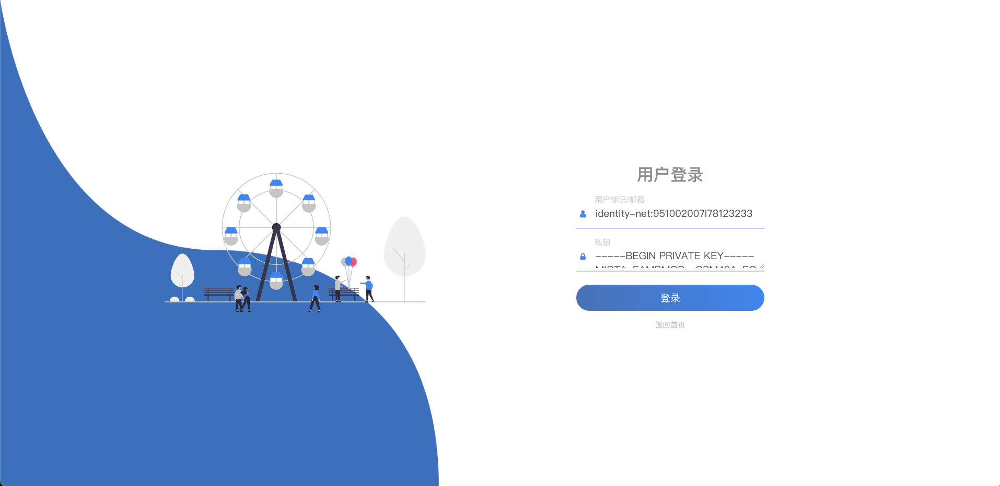
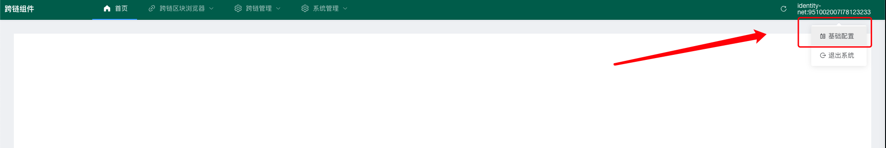
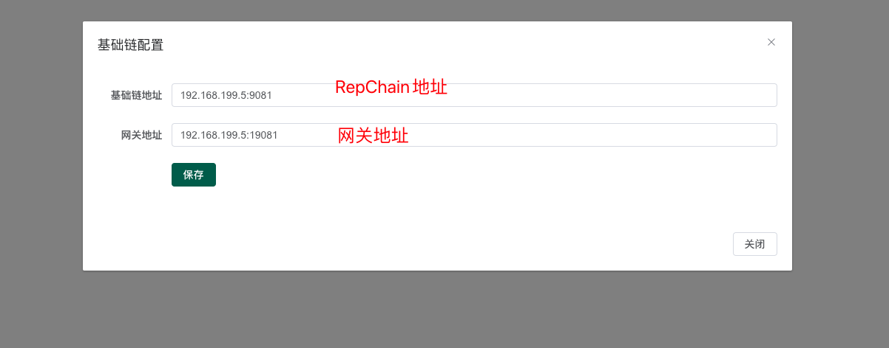
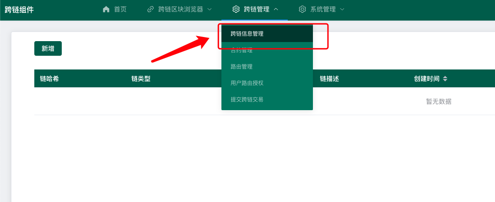
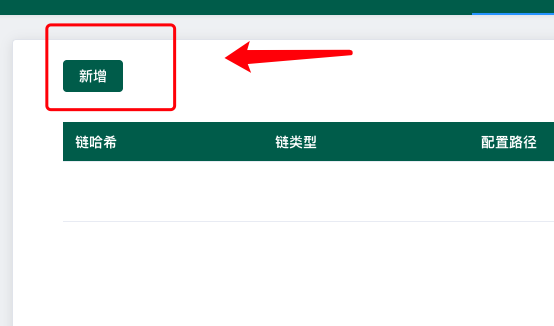
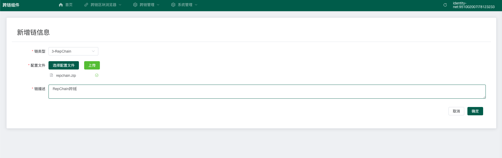
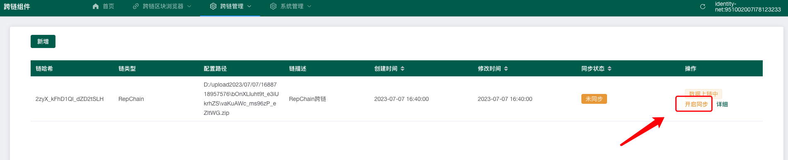
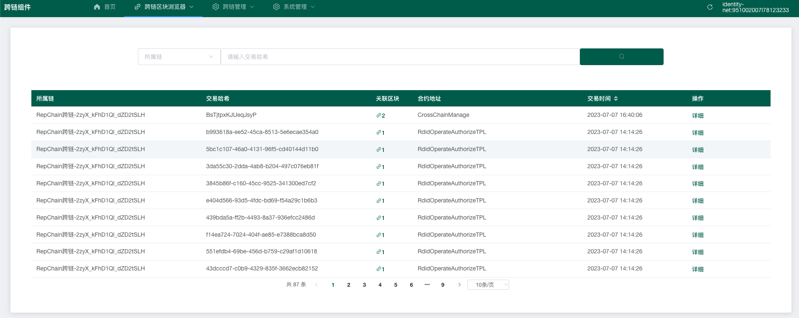

# 平台配置

## 一、登录平台，并配置基础项

### 1. 使用super_admin账户登录平台

### 2. 配置网关地址，及部署了跨链合约的RepChain地址

### 3. 创建第一个链信息

!!! warning "注意"

    第一个链信息，必须为部署了跨链合约的RepChain信息。

    如果操作过程中，当前行数据显示 **数据上链中**，则需要等待平台同步数据后，方可进行下一步操作。（创建第一个链信息时，开启数据同步除外）

* 点击跨链信息管理

* 点击新增

* 新增跨链信息，配置文件请询问管理员

* 点击开启同步 

!!! warning "注意"

    若此时，不是新增第一条链信息，则需要等待数据上链，在进行开启同步。
    
    检查方式为：刷新页面，当前行不再出现  **数据上链中**

* 开启同步后，可以在跨链区块链浏览器查看到区块和交易，至此，基础配置完成。

