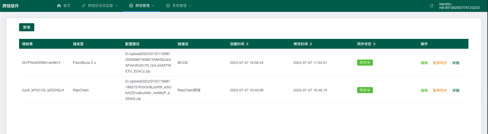
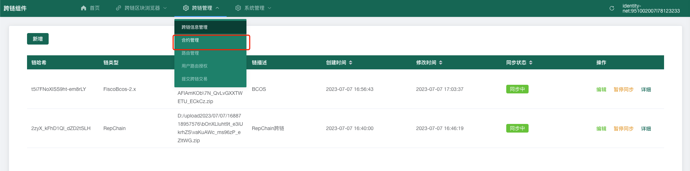
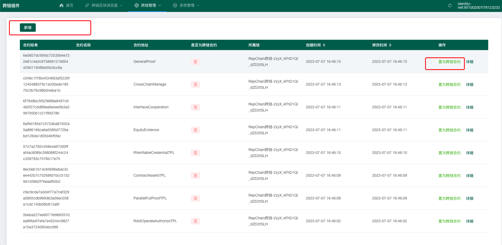
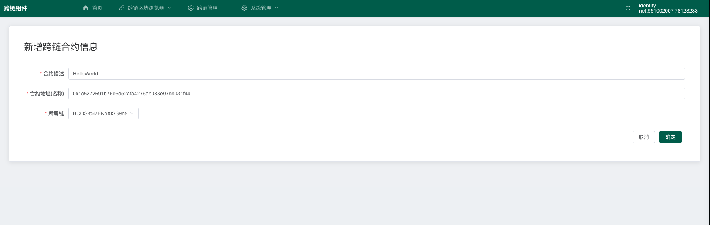
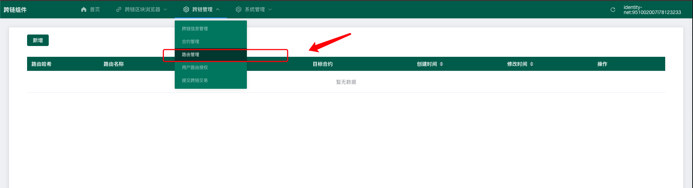
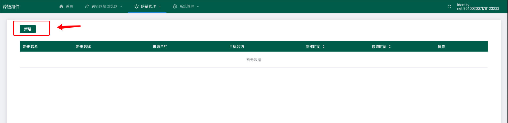
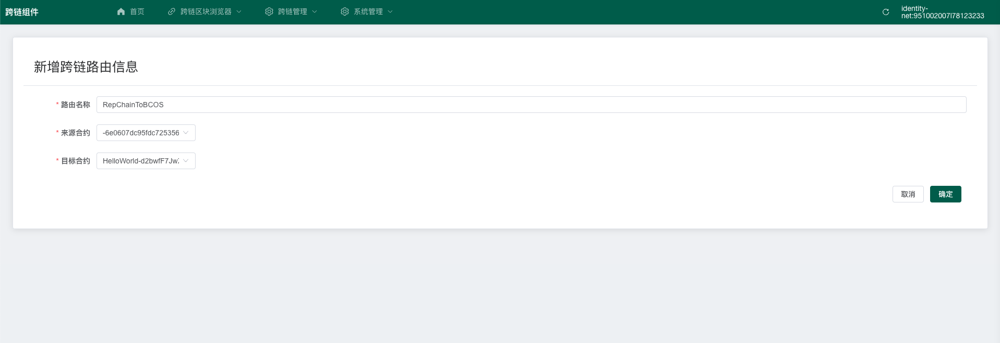

# 使用说明

## 一、链信息

> 新增链信息可参考[平台配置](../02.跨链组件管理平台/02.平台配置.md)

* 现在可以查看有两个链信息RepChain和Fisco Bcos

## 二、配置合约

* 点击合约管理

* 新增合约 （此处可以将RepChain现有合约转为跨链合约）

> 在下一步配置路由时，需要两个合约进行跨链操作，此处新建一个BCOS合约，将RepChain现有的一个合约转为跨链合约

## 三、路由管理

* 点击路由管理

* 点击新增，新增一个路由信息

!!! warning "注意"

    如果此时查看不到刚刚新增的跨链合约信息，等待一段时间后，刷新页面。

    或者，返回合约界面，查看合约是否已上链。

## 四、用户路由授权

!!! warning "注意"

    授权前，请等待路由信息成功上链

