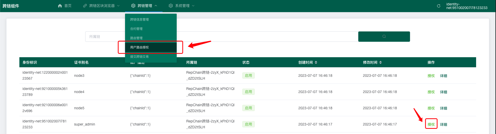
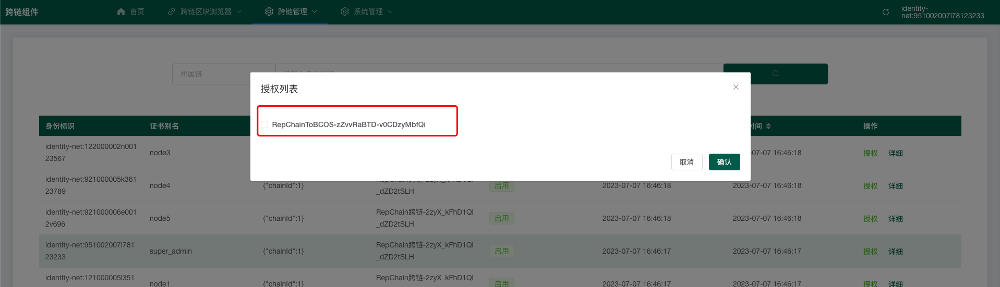
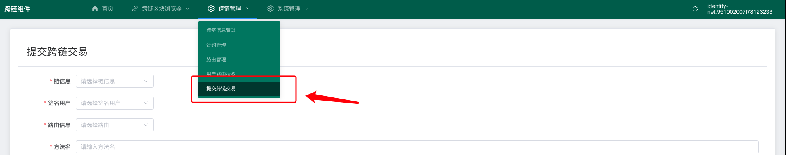
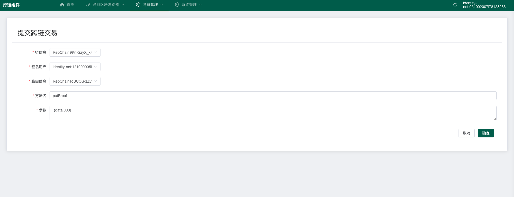

# 使用说明

## 一、链信息

> 新增链信息可参考[平台配置](../02.跨链组件管理平台/02.平台配置.md)

* 现在可以查看有两个链信息RepChain和Fisco Bcos

## 二、配置合约

* 点击合约管理

* 新增合约 （此处可以将RepChain现有合约转为跨链合约）

> 在下一步配置路由时，需要两个合约进行跨链操作，此处新建一个BCOS合约，将RepChain现有的一个合约转为跨链合约

## 三、路由管理

* 点击路由管理

* 点击新增，新增一个路由信息

!!! warning "注意"

    如果此时查看不到刚刚新增的跨链合约信息，等待一段时间后，刷新页面。

    或者，返回合约界面，查看合约是否已上链。

## 四、用户路由授权

!!! warning "注意"

    授权前，请等待路由信息成功上链

* 选择需要授权的用户，点击授权按钮

* 选择需要授权给当前用户的路由

## 五、提交跨链交易

* 提交跨链交易有两种方式，此处介绍通过界面进行提交，点击提交跨链交易

!!! warning "注意"

    此处可以选择向原链提交数据，也可以选择向目标链提交

    如果向FiscoBcos提交交易，需要通过控制台将参数进行编码，复制到表单中，再进行提交，编码方式参考下一章。

    签名账户现在默认为每个链三个账户，放置再网关下。

    如果需要增加，请联系管理员，将相关账户pem放置再网关配置文件夹下，并从数据库中添加相关账户信息，数据表为CROSS_GATEWAY_ACCOUNT。

